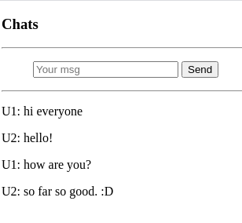

GRPC chat system with Rust + Grpc-web

Using Tonic (Rust grpc framework) as backend system. Grpc-web as the frontend code.

Folder struct
-------------

- :code:`protos`: define :code:`protobuf` messages and services.
- :code:`backend`: use :code:`tonic` as chat backend system.
- :code:`frontend`: grpc-web talk to backend. Insert js into :code:`index.html` for demo.

Backend
-------

I am using docker holding server with :code:`envoy`.

- Make sure the :code:`envoy.yaml` is correct setting and running.
- Do :code:`cargo run --bin server` to launch server with developing mode. (Please feel free try release mode)

Frontend
--------

- Move into :code:`cd frontend` folder.
- Generate protobuf related js files (in codebase, both :code:`_pb.js` already generated)::

  protoc -I=../protos chat.proto \
    --js_out=import_style=commonjs:./ \
    --grpc-web_out=import_style=commonjs,mode=grpcwebtext:./

- Compile JS library, please refer `here <https://grpc.io/docs/platforms/web/basics/#compile-the-js-library>`_

  - :code:`npm install`
  - :code:`npx webpack client.js`

- Open :code:`index.html` page in your browser.

  (You may got domain issue when visiting page, disable security to access :code:`chromium --disable-web-security --disable-gpu --user-data-dir=./chrometest`).
